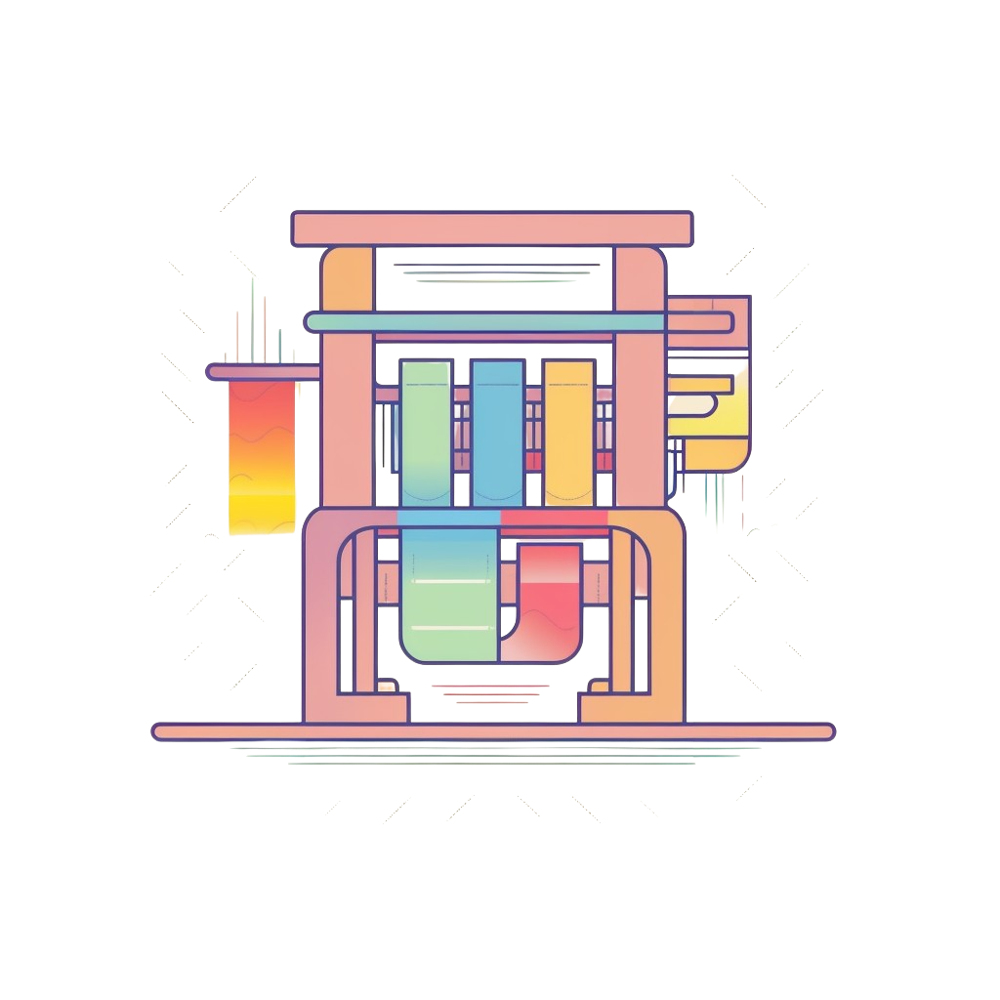

    
 

# Loom

Loom is a flexible library designed to interact with any LLM, with an emphasis on managing long conversations exceeding the maximum token limit of a model, ensuring a continuous and coherent user experience.

## Implementation

This library is a rust implementation of [OpenAI's Tactic](https://platform.openai.com/docs/guides/gpt-best-practices/tactic-for-dialogue-applications-that-require-very-long-conversations-summarize-or-filter-previous-dialogue) for handling long conversations with a token context bound LLM.

Once a certain threshold of context tokens is reached, the library will summarize the entire conversation and begin a new conversation with the summarized context appended to the system instructions.

The library is designed to be as flexible as possible, allowing you to easily integrate it into your own projects.

## Use Cases

- **Text-Based RPGs:** Crafting coherent and persistently evolving narratives and interactions in text-based role-playing games.

- **Customer Support Chatbots:** Developing chatbots that remember past user interactions and provide personalized support.

- **Educational Virtual Tutors:** Implementing AI tutors that remember student interactions and tailor assistance accordingly.

- **Healthcare Virtual Assistants:** Creating healthcare assistants that provide follow-up advice and reminders based on past user health queries.

- **AI-Driven MMO NPC Interactions:** Enhancing MMO experiences by enabling NPCs to have contextually relevant interactions with players based on past encounters.

## How to Use

Follow the [crate level documentation](https://docs.rs/loom/latest/loom/) for a detailed explanation of how to use the library.

## Contribution

If you are passioniate about this project, please feel free to fork the repository and submit pull requests for enhancements, bug fixes, or additional features.

## License

Loom is distributed under the MIT License, ensuring maximum freedom for using and sharing it in your projects.
